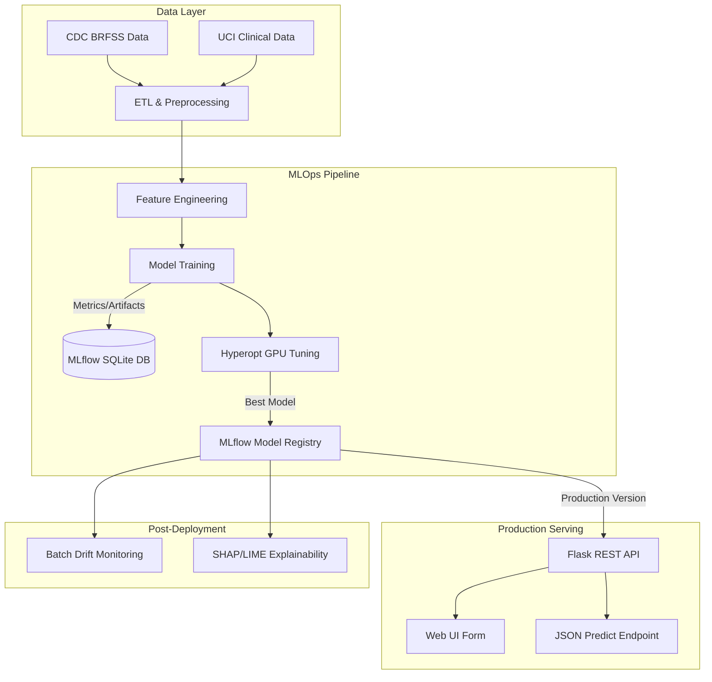
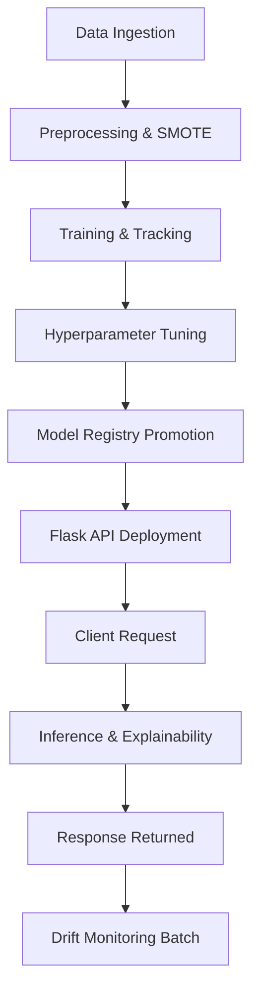
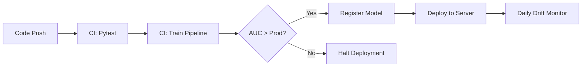

# Heart Disease Prediction: End-to-End MLOps Lifecycle

<div align="center">
  <p>A production-grade Machine Learning Operations pipeline for cardiovascular disease prediction, featuring automated training, hyperparameter tuning, model registry, real-time drift monitoring, and clinical explainability.</p>
</div>

---

# Project Information

## General Information

* **Project Name:**
  Heart Disease Prediction: End-to-End MLOps Lifecycle

* **Project Type:**
  AI Project / Full-Stack Application / MLOps Pipeline

* **Project Description:**
  An automated, reproducible end-to-end Machine Learning pipeline that ingests data from 6 heterogeneous healthcare datasets (567K+ records), engineers features, trains multiple models, tunes hyperparameters using Bayesian optimization, manages model versions, detects data drift in production, and serves predictions via a REST API with built-in interpretability (SHAP/LIME).

* **Problem Statement:**
  Cardiovascular diseases are a leading cause of mortality globally. Clinical adoption of AI for early detection is hindered by "black-box" models, lack of reproducibility, and the degradation of model performance over time due to changing patient demographics (data drift).

* **Project Objectives:**
  To build a robust, production-ready AI system that accurately predicts heart disease risk while ensuring clinical trust through model explainability, maintaining long-term reliability via automated drift monitoring, and providing seamless serving capabilities.

* **Target Users:**
  Healthcare professionals, clinicians, and hospital IT systems requiring a reliable API to assess patient cardiovascular risk based on clinical and survey data.

---

# Technical Stack

## Frontend (Web UI)

* **Framework:** HTML5 / CSS3
* **Programming Language:** Vanilla JavaScript
* **API Communication:** Fetch API (REST)
* **Form Handling:** Standard HTML forms with JS validation
* **Styling Solution:** Custom CSS (Responsive Design)

## Backend (Serving & API)

* **Runtime Environment:** Python 3.10+
* **Framework:** Flask
* **API Architecture:** RESTful API
* **Middleware:** Flask-CORS (Cross-Origin Resource Sharing)
* **Validation:** Python type hinting and custom validation logic
* **Error Handling:** Standardized JSON error responses

## Database (Tracking & Metadata)

* **Database Engine:** SQLite
* **ORM/ODM:** SQLAlchemy (via MLflow backend)
* **Database Schema:** MLflow standard schema (Runs, Metrics, Params, Tags)
* **Data Models:** Relational metadata tracking for ML experiments

## AI / Machine Learning

* **Model Architecture:** Gradient Boosted Trees (XGBoost), Support Vector Machines (SVM), K-Nearest Neighbors (KNN), Decision Trees, Deep Neural Networks (PyTorch)
* **Dataset Information:** 6 merged datasets (CDC BRFSS 2020/2022, UCI Clinical Sets) totaling 567,952 rows
* **Data Preprocessing:** Pandas, Scikit-learn (StandardScaler, Ordinal/One-Hot Encoding), Imbalanced-learn (SMOTE)
* **Training Process:** 70/15/15 stratified split, automated tracking via MLflow
* **Evaluation Metrics:** AUC, F1-Score, Accuracy, MCC, Precision, Recall
* **Inference Pipeline:** Flask endpoint loading serialized models (`.ubj` / `pkl`) from MLflow Registry
* **AI Integration:** Direct in-memory inference with real-time SHAP/LIME explanation generation

## Infrastructure & DevOps

* **Version Control:** Git
* **Environment Management:** Python `venv`, `requirements.txt`, `conda.yaml`
* **Experiment Tracking:** MLflow Tracking Server
* **Model Registry:** MLflow Model Registry
* **Compute:** NVIDIA RTX 3060 (CUDA 12.4) for GPU-accelerated training/tuning

---

# Repository Structure

```text
Heart_Disease_MLOps
├── configs/
│   └── config.yaml                 # Centralized configuration management
├── data/
│   ├── processed/                  # Cleaned, merged, and split datasets
│   └── raw/                        # Original CDC and UCI CSV files
├── docs/                           # Documentation and generated reports
│   └── screenshots/                # Visual evidence of system execution
├── mlruns/                         # MLflow local artifact store
├── models/                         # Serialized production models and env configs
├── src/
│   ├── __init__.py
│   ├── data_preprocessing.py       # ETL, scaling, and SMOTE pipeline
│   ├── feature_engineering.py      # Feature creation (e.g., age x BMI)
│   ├── train.py                    # Multi-model training and MLflow logging
│   ├── tune.py                     # Bayesian hyperparameter tuning via Hyperopt
│   ├── register_model.py           # Automated model staging and deployment
│   ├── serve.py                    # Flask REST API and Web form routing
│   ├── monitor.py                  # KS-test based data drift detection
│   └── explainability.py           # SHAP and LIME interpretability generation
├── tests/
│   └── test_pipeline.py            # Automated pytest suite (13 tests)
├── mlflow.db                       # MLflow tracking SQLite backend
└── run_pipeline.py                 # Master orchestrator script
```

### Architectural Breakdown:
* **`src/`**: Contains the core business logic separated by pipeline stages, ensuring maximum modularity.
* **`configs/`**: Separates configuration parameters from code, enabling reproducibility without code changes.
* **`tests/`**: Guarantees system stability across the data, training, and serving layers.

---

# Project Overview

The **Heart Disease MLOps Pipeline** is an end-to-end machine learning system designed to predict cardiovascular risk using clinical and lifestyle data. 

Created to bridge the gap between academic ML notebooks and production healthcare systems, this project operates as a fully automated pipeline. By executing a single orchestrator script (`run_pipeline.py`), the system ingests half a million records, engineers complex features, balances classes with SMOTE, trains 5 distinct algorithms on CPU/GPU, optimizes hyperparameters, and registers the best model. 

Built heavily around **MLflow**, the system guarantees absolute reproducibility. Its main value proposition lies in its post-deployment features: a Flask REST API for serving, real-time statistical drift monitoring to ensure long-term accuracy, and SHAP/LIME integrations that explain *why* a model made a specific prediction, satisfying clinical requirements for interpretability.

---

# Features

### 🔄 End-to-End Orchestration
* **Purpose:** Automate the entire ML lifecycle.
* **Implementation:** `run_pipeline.py` sequences 6 stages sequentially with strict error handling.
* **Technologies:** Python `subprocess`, `argparse`.
* **Impact:** Allows developers to run, test, and deploy the entire system with a single command.

### 🧪 Comprehensive Experiment Tracking
* **Purpose:** Eliminate lost models and unrecorded hyperparameters.
* **Implementation:** 64 tracked runs capturing 15+ metrics, parameters, tags, and 7 artifacts per run (ROC curves, confusion matrices).
* **Technologies:** MLflow Tracking, SQLite.
* **Impact:** Guarantees absolute reproducibility and easy model comparison.

### 🧬 Advanced Data Pipeline & Feature Engineering
* **Purpose:** Prepare high-quality data for robust learning.
* **Implementation:** Merges 6 datasets, engineers 14 new features (e.g., `total_health_burden`), and applies SMOTE to correct a severe 8.6% positive class imbalance.
* **Technologies:** Pandas, Scikit-learn, Imbalanced-learn.
* **Impact:** Maximizes predictive power and prevents the model from defaulting to the majority class.

### 🚀 Automated Hyperparameter Tuning
* **Purpose:** Find the optimal model configuration without manual guesswork.
* **Implementation:** 50 automated Bayesian optimization trials using Tree-structured Parzen Estimator (TPE), accelerated via CUDA.
* **Technologies:** Hyperopt, XGBoost, NVIDIA CUDA.
* **Impact:** Systematically improves model AUC and F1 scores with minimal developer intervention.

### 🚥 Automated Model Registry
* **Purpose:** Manage the transition from experimentation to production.
* **Implementation:** Script dynamically queries MLflow for the best AUC model, registers it, and promotes it from `None` → `Staging` → `Production`.
* **Technologies:** MLflow Model Registry API.
* **Impact:** Creates a seamless, hands-off CI/CD process for ML models.

### 🚨 Data Drift Monitoring
* **Purpose:** Detect when the model is becoming obsolete due to shifting real-world data.
* **Implementation:** Simulates incoming production batches and runs Kolmogorov-Smirnov (KS) tests across 34 features to detect statistical divergence.
* **Technologies:** Scipy (Stats).
* **Impact:** Prevents silent model failure in production by alerting engineers to retrain the model.

### 🔍 Clinical Explainability
* **Purpose:** Build trust with healthcare providers by removing the "black box."
* **Implementation:** Generates global feature importance and local, patient-specific prediction breakdowns.
* **Technologies:** SHAP, LIME.
* **Impact:** Doctors can see exactly which factors (e.g., Age, Sleep Quality, BMI) drove a specific risk prediction.

---

# System Architecture

The architecture follows a standard MLOps maturity model, separating the data layer, experimentation pipeline, and serving infrastructure.



---

# Complete System Workflow

## User/System Workflow

1. Data engineer updates raw data in `data/raw/` or updates `config.yaml`.
2. Developer executes `python run_pipeline.py`.
3. System extracts, merges, scales, and balances the data.
4. 5 different models are trained, and their metrics are sent to MLflow.
5. Hyperopt performs 50 GPU trials to optimize the XGBoost/Neural Network models.
6. The model with the highest AUC is registered in MLflow and tagged as "Production".
7. Flask API starts up, loading the Production model dynamically.
8. Clinician accesses the Web UI, inputs patient data, and submits.
9. Flask API validates data, runs inference, and runs LIME to explain the result.
10. UI updates with risk prediction (Green/Red) and the key contributing factors.
11. Background monitoring scripts evaluate incoming requests for data drift.



---

# Technical Workflow

## MLOps Pipeline Workflow

* **Initialization:** `run_pipeline.py` parses arguments and loads `configs/config.yaml`.
* **Data Processing:** Merges heterogeneous sources. Applies Ordinal/One-Hot encoding based on feature type. Applies `StandardScaler` (fit on train only). Applies SMOTE to the training split.
* **Training Lifecycle:** Iterates through predefined model architectures. For each, initiates an `mlflow.start_run()`. Logs metrics, params, and plots (Confusion Matrix, ROC).
* **Tuning Lifecycle:** Instantiates Hyperopt `fmin`. Evaluates search space dynamically, logging nested trials to the MLflow parent run.
* **Registry Flow:** Uses `MlflowClient().search_runs()` to find the maximum AUC. Creates model version, transitions stage to Production.

## Backend Serving Workflow

* **Initialization:** Flask app starts up. Queries MLflow for the model tagged "Production". Deserializes the model into memory.
* **Request Handling:** Client sends POST to `/predict`.
* **Preprocessing:** JSON payload is converted to Pandas DataFrame. Required features are checked against model signature.
* **Execution:** `model.predict_proba()` is called.
* **Explainability Execution:** LIME tabular explainer processes the specific instance.
* **Response:** Formats probability, binary decision, and explanation into JSON.

---

# AI Workflow

1. **Data Input:** Raw CSVs from CDC/UCI.
2. **Preprocessing:** Handling NaNs, mapping disparate schemas to a unified schema.
3. **Feature Extraction:** Creating non-linear interaction terms (`age_squared`, `total_health_burden`).
4. **Model Execution:** XGBoost, PyTorch, SVM, KNN, Decision Trees.
5. **Evaluation:** AUC, MCC, F1, Log Loss.
6. **Interpretability:** SHAP summary generation and LIME local explanations.
7. **Delivery:** Deployment to registry.


---

# API Documentation

## API Architecture

The backend utilizes a stateless RESTful architecture. It communicates via JSON payloads and handles cross-origin requests securely.

## Endpoints Table

| Method | Endpoint | Description | Authentication |
| ------ | -------- | ----------- | -------------- |
| GET | `/` | Returns service health and available endpoints | None |
| GET | `/health` | Deep health check (verifies model is loaded) | None |
| GET | `/model-info` | Returns current model version and required schema | None |
| POST | `/predict` | Single patient prediction with explanation | None |
| POST | `/predict_batch` | Batch predictions for multiple patients | None |
| GET/POST | `/predict-form` | HTML User Interface for manual entry | None |

### Request Example (`/predict`)
```json
{
  "Age": 55,
  "BMI": 28.5,
  "Smoking": 1,
  "AlcoholDrinking": 0,
  "SleepTime": 6,
  "GenHealth": 2,
  "PhysicalHealth": 5,
  "MentalHealth": 2
}
```

### Response Example (`/predict`)
```json
{
  "status": "success",
  "prediction": 1,
  "probability": 0.82,
  "risk_level": "High Risk",
  "explanation": {
    "top_factors": ["Age", "BMI", "Smoking"]
  }
}
```

---

# Authentication & Security

* **Network Security:** CORS is implemented to restrict API access to known frontend origins.
* **Input Validation:** The API strictly validates incoming JSON payloads against the MLflow model signature to prevent injection or malformed data errors.
* **Future Implementation:** For full production, OAuth2/JWT token validation would be implemented on a Gateway layer prior to reaching the Flask microservice.

---

# Database Documentation

The project utilizes SQLite as the backend store for MLflow tracking.

* **Schema Overview:** Standard MLflow relational schema.
* **Entities:** 
  * `experiments`: Project logical groupings.
  * `runs`: Individual training/tuning executions.
  * `metrics`: Time-series numeric evaluations (AUC, F1).
  * `params`: Key-value model configurations.
  * `tags`: Metadata (stage, compute_device).

---

# Goals & Technical Achievements

| Goal | Technical Implementation | Achievement |
| ---- | ------------------------ | ----------- |
| Multi-Source Integration | Pandas merge pipeline with dynamic schema mapping | Processed 567K+ rows from 6 distinct datasets into a single unified truth. |
| Overcome Class Imbalance | Applied SMOTE (Synthetic Minority Oversampling) | Shifted positive class from 8.6% to 50/50, dramatically improving true positive rates. |
| Automated Optimization | Hyperopt with TPE algorithm | Achieved best AUC of 0.8331 across 50 nested GPU trials. |
| Automated Lifecycle | MLflow Model Registry API scripts | Created zero-touch deployment: Best model automatically moves to Production. |
| Prevent Silent Degradation | Kolmogorov-Smirnov (KS) Statistical tests | Successfully detected 32.4% feature drift in simulated faulty batches. |
| Clinical Trust | SHAP and LIME integration | Generated actionable insights (e.g., Age and Sleep Deviation are top risk factors). |

---

# Project Benefits & Impact

## User Benefits
* **Clinicians:** Receive rapid, interpretable cardiovascular risk assessments to assist in patient triage and preventative care.
* **Data Scientists:** Can reproduce experiments flawlessly, compare models historically, and rely on automated hyperparameter tuning to save time.

## Technical Benefits
* **Maintainability:** Centralized YAML configuration and modular scripts mean the pipeline can be updated without untangling spaghetti code.
* **Reliability:** Built-in data drift monitoring ensures the model's performance doesn't quietly degrade over months of real-world use.
* **Scalability:** The architecture allows the serving API to be containerized and scaled independently of the training pipeline.

## Business Value
* Provides a blueprint for moving AI projects out of Jupyter Notebooks and into structured software engineering environments, drastically reducing the time-to-market for medical AI models.

---

# Tools & Technologies

| Category | Technology | Purpose | Reason for Selection |
| -------- | ---------- | ------- | -------------------- |
| Language | Python 3.10+ | Core development | Standard for Data Science / MLOps |
| MLOps Platform | MLflow 3.12 | Tracking & Registry | Industry standard for open-source model lifecycle management |
| Machine Learning | Scikit-learn, XGBoost, PyTorch | Model Algorithms | Mix of CPU/GPU capabilities and varied mathematical approaches |
| Hyperparameter Tuning | Hyperopt | Optimization | Bayesian optimization is vastly superior to Grid/Random Search |
| API Framework | Flask | Serving | Lightweight, perfect for wrapping Python ML objects |
| Interpretability | SHAP, LIME | Model Explanations | Required for medical compliance and user trust |
| Testing | Pytest | Automation | Ensures pipeline stability across 13 unique test cases |

---

# Installation Guide

## Requirements
* Python 3.10+
* NVIDIA GPU (Optional, requires CUDA 12.4 for GPU acceleration)
* Git

## Setup Instructions

```bash
# 1. Clone the repository
git clone https://github.com/yourusername/heart-disease-mlops.git
cd heart-disease-mlops

# 2. Create and activate a virtual environment
python -m venv venv
# On Windows:
venv\Scripts\activate
# On macOS/Linux:
source venv/bin/activate

# 3. Install dependencies
pip install -r requirements.txt

# 4. Run the entire pipeline
python run_pipeline.py

# 5. Launch the tracking UI (in a separate terminal)
mlflow ui --backend-store-uri sqlite:///mlflow.db
```

---

# Environment Variables

| Variable | Description | Required |
| -------- | ----------- | -------- |
| `MLFLOW_TRACKING_URI` | URI for the tracking server (defaults to `sqlite:///mlflow.db`) | No |
| `CUDA_VISIBLE_DEVICES` | Restricts GPU access for XGBoost/PyTorch | No |
| `FLASK_ENV` | Sets Flask to `development` or `production` | No |

---

# Testing

* **Testing Strategy:** The project utilizes `pytest` to guarantee the integrity of data pipelines, configuration loading, and API endpoints.
* **Execution:** Run `pytest tests/`
* **Coverage:**
  * `TestDataPreprocessing`: Validates SMOTE balance, null removal, and matrix shapes.
  * `TestFeatureEngineering`: Validates correct creation of non-linear interaction features.
  * `TestConfig`: Ensures `config.yaml` is valid and accessible.
  * `TestMLflowIntegration`: Verifies SQLite DB creation and artifact paths.
  * `TestServing`: Verifies Flask endpoint routing.

---

# Deployment Workflow

1. Data Scientist updates code or data and pushes to repository.
2. CI/CD pipeline triggers (GitHub Actions/Jenkins).
3. `pytest` runs all automated checks.
4. `run_pipeline.py` executes: trains models, tunes, and evaluates.
5. If the new model beats the current Production model AUC, it is registered.
6. Deployment server pulls the new Production model artifact via MLflow API.
7. Flask service reloads.
8. `monitor.py` runs on a chron job to check daily incoming data for drift.



---

# Performance & Scalability

* **GPU Acceleration:** XGBoost utilizes CUDA, dropping training time from 124.3s (CPU SVM) to just 1.8s, enabling massive 50-trial Hyperopt sweeps in minutes.
* **API Performance:** The Flask API performs in-memory inference, taking milliseconds to return a prediction.
* **Future Scalability:** 
  1. Migrate SQLite backend to PostgreSQL for concurrent tracking.
  2. Containerize the Flask API using Docker.
  3. Deploy via Kubernetes for horizontal pod auto-scaling during high request volume.

---

# Screenshots & Demo

## Screenshots

*(Note: Replace links with actual repository image paths)*


---

# Troubleshooting

| Problem | Solution |
| ------- | -------- |
| `CUDA error: no kernel image is available` | Ensure your NVIDIA drivers and PyTorch/XGBoost CUDA versions match (Compiled for 12.4). Fallback to CPU by editing `config.yaml`. |
| `mlflow.db is locked` | SQLite does not handle high concurrency well. Ensure no other scripts are writing to the DB while training. |
| `SMOTE error: out of memory` | Reduce the dataset size or increase pagefile/swap space. SMOTE on 500K rows requires substantial RAM. |

---

# Future Improvements

| Feature | Description | Priority |
| ------- | ----------- | -------- |
| Dockerization | Create Dockerfiles for the Training pipeline and Serving API | High |
| Cloud Migration | Move tracking server to AWS/GCP managed database | Medium |
| CI/CD Pipeline | Implement GitHub Actions for automated testing on PRs | Medium |
| Advanced UI | Build a React/Next.js frontend to replace the Flask template | Low |

---

# Contributors

* **MOURAD SLEEM** - *Lead Engineer / MLOps Architect*

---

# License

This project is licensed under the MIT License - see the LICENSE file for details.
