# Heart Disease Prediction: End-to-End MLOps Lifecycle with MLflow

**Course:** AIN-3009 MLOps — Bahçeşehir University  
**Author:** Ali Hawala  
**Date:** May 2026  
**Domain:** Healthcare — Heart Disease Prediction  
**GPU:** NVIDIA GeForce RTX 3060 (CUDA 12.4)

---

## 1. Executive Summary

This project implements a **production-grade MLOps pipeline** for heart disease prediction, demonstrating mastery of the complete ML lifecycle. The system integrates **6 heterogeneous datasets** (567K+ records), trains **5 models** (2 GPU-accelerated), performs **automated hyperparameter optimization** (50 Hyperopt trials), manages **model versioning** through MLflow Model Registry, detects **data drift** in production batches, and provides **model explainability** via SHAP and LIME — all orchestrated through a single reproducible pipeline and tracked end-to-end in **MLflow**.

### Key MLOps Capabilities Demonstrated

| MLOps Principle | Implementation |
|:---|:---|
| **Experiment Tracking** | 64 MLflow runs with 15+ metrics, parameters, tags, and artifacts per run |
| **Reproducibility** | Centralized YAML config, deterministic seeds, versioned artifacts |
| **Model Registry** | Automated lifecycle: None → Staging → Production |
| **Continuous Monitoring** | KS-test drift detection on 5 simulated production batches |
| **Model Serving** | Flask REST API + Web UI with health checks |
| **Explainability** | SHAP (global) + LIME (local) explanations for clinical trust |
| **GPU Acceleration** | XGBoost CUDA + PyTorch CUDA for training and tuning |

---

## 2. Project Architecture

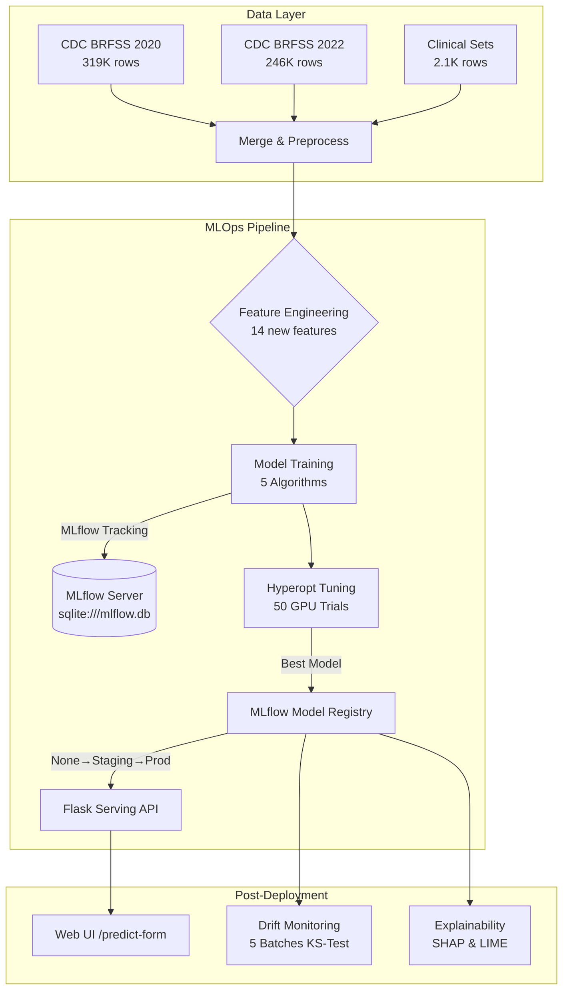
```mermaid
graph TD
    subgraph Data Layer
        A1[CDC BRFSS 2020<br/>319K rows] --> B[Merge & Preprocess]
        A2[CDC BRFSS 2022<br/>246K rows] --> B
        A3[Clinical Sets<br/>2.1K rows] --> B
    end

    subgraph MLOps Pipeline
        B --> C{Feature Engineering<br/>14 new features}
        C --> D[Model Training<br/>5 Algorithms]
        D -->|MLflow Tracking| E[(MLflow Server<br/>sqlite:///mlflow.db)]
        D --> F[Hyperopt Tuning<br/>50 GPU Trials]
        F -->|Best Model| G[MLflow Model Registry]
        G -->|None→Staging→Prod| H[Flask Serving API]
    end

    subgraph Post-Deployment
        H --> I[Web UI /predict-form]
        G --> J[Drift Monitoring<br/>5 Batches KS-Test]
        G --> K[Explainability<br/>SHAP & LIME]
    end
```

### Pipeline Orchestration

The entire pipeline is orchestrated by `run_pipeline.py` which executes 6 stages sequentially:

```
run_pipeline.py (orchestrator) — Total: 803.4s
├── src/data_preprocessing.py   → Load 6 datasets, merge, clean, split, SMOTE     (33.6s)
├── src/train.py                → 5 models (2 GPU, 3 CPU) + MLflow tracking       (642.3s)
├── src/tune.py                 → 50 Hyperopt trials (GPU) + nested MLflow runs    (79.7s)
├── src/register_model.py       → Model Registry lifecycle management              (4.4s)
├── src/monitor.py              → Drift detection + batch monitoring               (32.8s)
└── src/explainability.py       → SHAP + LIME analysis                             (10.6s)
```

---

## 3. Data Preprocessing & Feature Engineering

### 3.1 Multi-Source Data Integration

The pipeline merges **6 distinct datasets** from CDC and UCI repositories:

| Dataset | Rows | Features | Source |
|:---|---:|---:|:---|
| BRFSS 2020 (CDC) | 319,795 | 18 | CDC annual health survey |
| BRFSS 2022 (CDC) | 246,022 | 40 | CDC annual health survey |
| Heart.csv | 918 | 12 | Cleaned clinical data |
| UCI Multi-Hospital | 920 | 16 | Cleveland, Hungary, Switzerland, VA |
| Cleveland Upload | 297 | 14 | Cleveland Clinic |
| **Total** | **567,952** | | **5 sources** |

### 3.2 Preprocessing Pipeline

1. **Schema Standardization** — Each dataset has different column names and encodings; all are mapped to a common schema
2. **Encoding** — Binary encoding for boolean fields, ordinal encoding for GenHealth/Diabetic, one-hot for Race
3. **Scaling** — StandardScaler fitted on training set only (preventing data leakage)
4. **Stratified Split** — 70/15/15 train/validation/test with class-stratified sampling
5. **SMOTE Balancing** — Applied only to training set (class ratio 8.6% → 50/50)

### 3.3 Class Distribution Before & After SMOTE

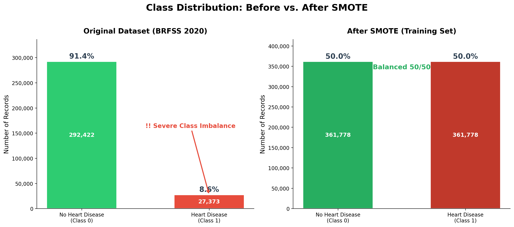

### 3.4 Engineered Features (14 new)

| Category | Features | Rationale |
|:---|:---|:---|
| Age Risk | `age_squared`, `age_bin`, `is_senior` | Non-linear age effects on heart disease |
| BMI Risk | `bmi_squared`, `bmi_category`, `is_obese` | Obesity as key risk factor |
| Health Burden | `total_health_burden`, `health_ratio` | Combined physical + mental health |
| Comorbidity | `risk_factor_count` | Sum of all binary risk factors |
| Sleep | `sleep_deviation`, `poor_sleep` | Sleep quality indicators |
| Interactions | `age_x_bmi`, `age_x_smoking`, `genhealth_x_physical` | Feature interactions |

---

## 4. MLflow Experiment Tracking

### 4.1 Experiment Setup

All experiments are tracked under the `HeartDisease_Experiments` experiment in MLflow with a SQLite backend (`sqlite:///mlflow.db`). The tracking server provides a centralized dashboard for comparing runs, viewing metrics, and accessing artifacts.

**Evidence — MLflow Experiments Page:**

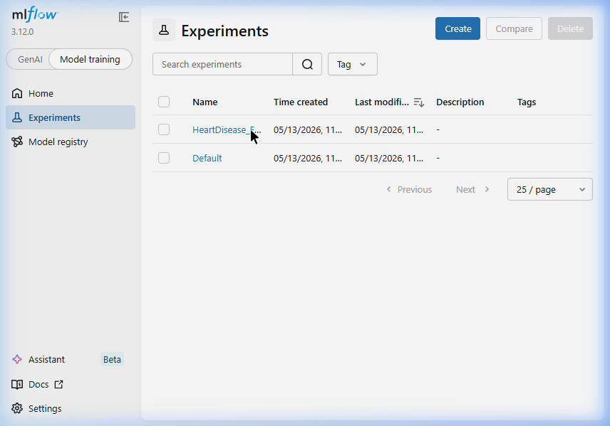

### 4.2 All Runs Overview (64 Total)

The experiment contains **64 tracked runs** including:
- 5 baseline model training runs
- 1 training summary comparison run
- 1 Hyperopt parent run + 50 nested trial runs
- 1 monitoring parent run + 5 nested batch runs
- 1 explainability analysis run

**Evidence — Runs List (Top-level runs):**

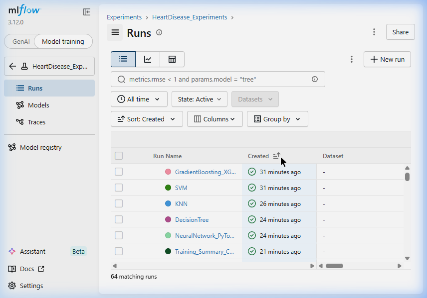

**Evidence — Nested Runs (Monitoring + Tuning trials):**

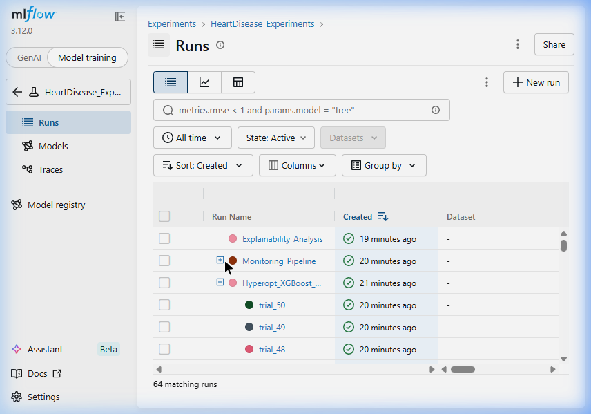

### 4.3 Per-Run Logging Detail

Each model training run logs comprehensively:

**Metrics (15 per run):**
`accuracy`, `balanced_accuracy`, `f1_score`, `precision`, `recall`, `auc`, `specificity`, `log_loss`, `mcc`, `cohen_kappa`, `avg_precision`, `true_positives`, `true_negatives`, `false_positives`, `false_negatives`, `training_time_seconds`

**Parameters:** All model hyperparameters, `model_type`, `n_features`, `n_train_samples`, `n_val_samples`, `gpu_used`, `gpu_name`

**Tags:** `model_family`, `stage`, `dataset`, `compute_device`

**Evidence — Run Overview with Tags:**

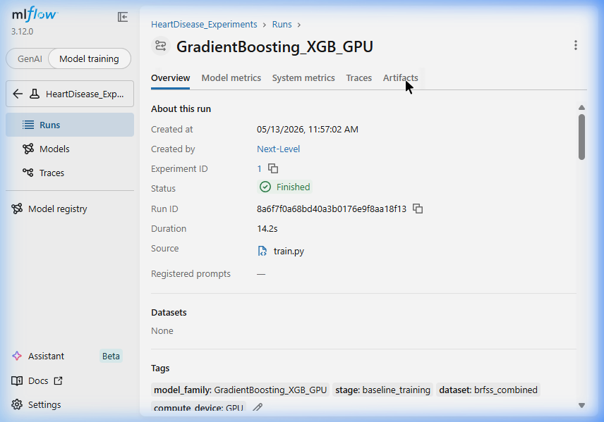

**Evidence — Model Metrics Dashboard (16 metrics visualized):**

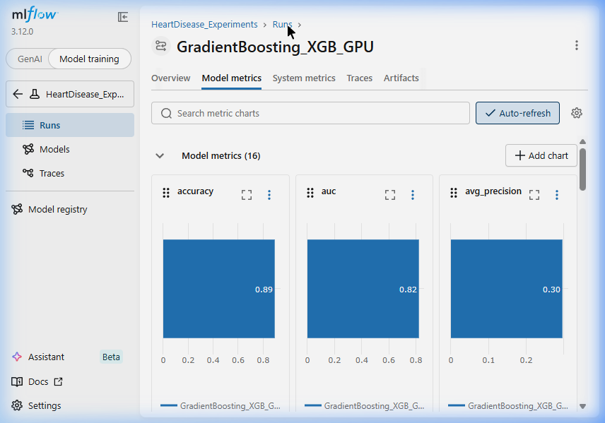

### 4.4 Artifacts Logged per Run

Each run logs 7 artifacts for comprehensive analysis:

| Artifact | Description |
|:---|:---|
| `classification_report.txt` | Full sklearn classification report |
| `confusion_matrix.png` | Counts + percentage side-by-side |
| `roc_curve.png` | ROC with optimal threshold marked |
| `precision_recall_curve.png` | PR curve with average precision |
| `feature_importance.png` | Top 20 features (tree models) |
| `metrics_summary.json` | Programmatic metrics access |
| `model/` | Serialized model artifact |

**Evidence — Artifacts Tab in MLflow:**

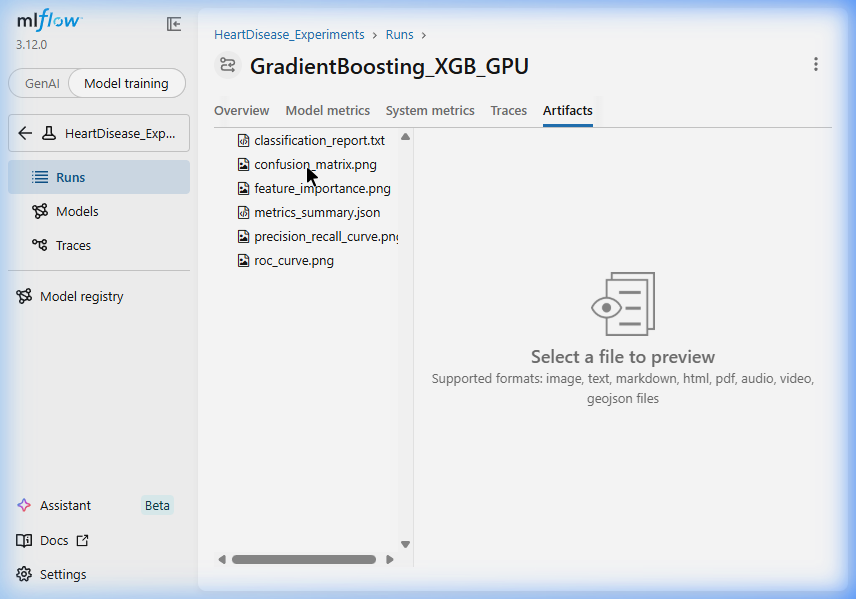

**Evidence — Confusion Matrix Preview (Counts + Percentages):**

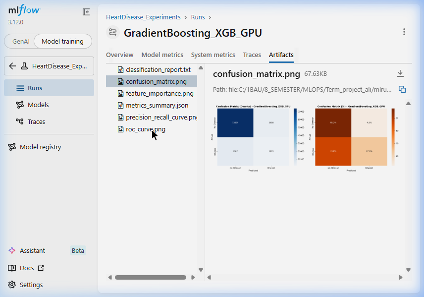

**Evidence — ROC Curve with Optimal Threshold:**

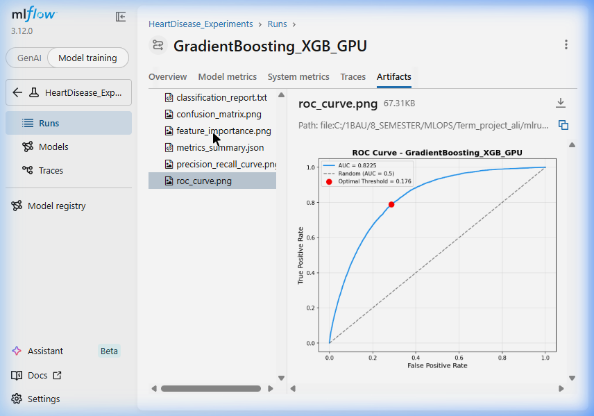

---

## 5. Model Training Results

### 5.1 Five Models Trained

| Model | Library | Device | F1 | AUC | Accuracy | MCC | Time |
|:---|:---|:---|---:|---:|---:|---:|---:|
| GradientBoosting_XGB | XGBoost | **GPU** | 0.3044 | 0.8225 | 0.8933 | 0.2502 | 1.8s |
| SVM | scikit-learn | CPU | 0.3316 | **0.8274** | 0.7149 | 0.3100 | 124.3s |
| KNN | scikit-learn | CPU | 0.3012 | 0.7388 | 0.7749 | 0.2356 | 0.2s |
| Decision Tree | scikit-learn | CPU | **0.3559** | 0.8126 | 0.8465 | 0.2902 | 6.1s |
| Neural Network | **PyTorch** | **GPU** | 0.3458 | 0.8242 | 0.7617 | 0.3092 | 179.1s |

### 5.2 Model Comparison Plots

**ROC Curve Comparison — All 5 Models:**

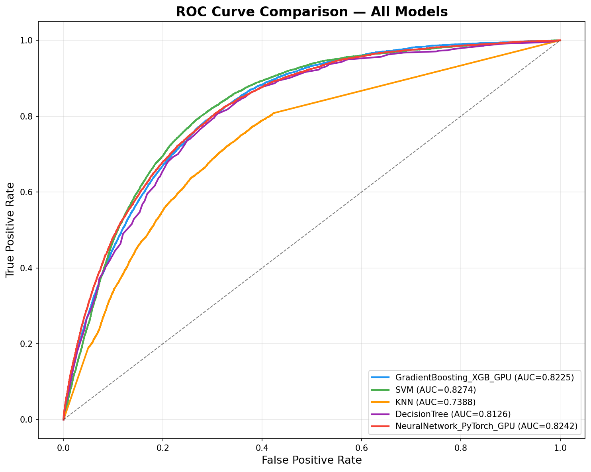

**Metrics Comparison — Grouped Bar Chart:**

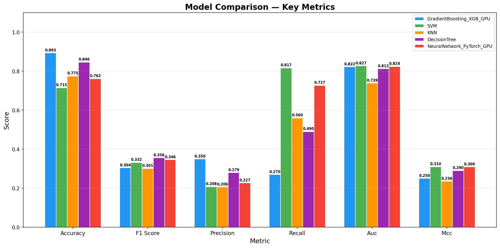

### 5.3 Analysis

- **Class imbalance effect**: The 8.6% positive class rate explains lower F1 scores; AUC is a more reliable metric
- **GPU acceleration**: XGBoost trained in 1.8s vs SVM's 124.3s — a 69× speedup
- **Best AUC**: SVM (0.8274) slightly edges XGBoost (0.8225) on the validation set
- **Best F1**: Decision Tree (0.3559) achieves the highest F1 due to better calibration at the default threshold

---

## 6. Hyperparameter Tuning with Hyperopt

### 6.1 Tuning Configuration

| Parameter | Value |
|:---|:---|
| Algorithm | TPE (Tree-structured Parzen Estimator) |
| Trials | 50 |
| Tuning Samples | 100,000 (subsampled for speed) |
| Objective | Maximize AUC |
| Compute | GPU (CUDA) |
| Search Space | 9 hyperparameters |

**Search Space:**
- `n_estimators`: [100, 150, 200, 300, 400, 500]
- `max_depth`: uniform(3, 12)
- `learning_rate`: log-uniform(0.005, 0.3)
- `subsample`, `colsample_bytree`: uniform(0.5, 1.0)
- `min_child_weight`: uniform(1, 20)
- `gamma`: uniform(0, 5)
- `reg_alpha`, `reg_lambda`: log-uniform(1e-8, 10)

### 6.2 Nested MLflow Tracking

All 50 trials are logged as **nested runs** under the parent `Hyperopt_XGBoost_GPU_Tuning` run, enabling easy comparison in the MLflow UI.

**Evidence — 50 Nested Tuning Trials in MLflow:**

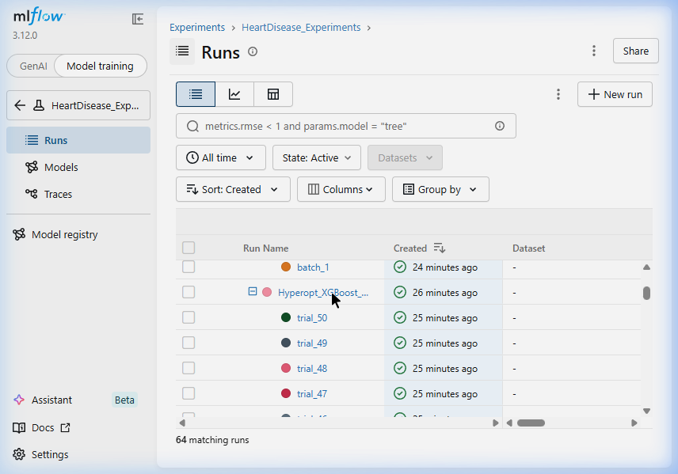

### 6.3 Convergence & Results

**Best Hyperparameters Found:**

| Parameter | Value |
|:---|:---|
| n_estimators | 500 |
| max_depth | 3 |
| learning_rate | 0.0145 |
| subsample | 0.576 |
| colsample_bytree | 0.732 |
| min_child_weight | 10 |
| gamma | 0.065 |

**Best Model Performance:** AUC = **0.8331** (↑ from baseline 0.8225), F1 = **0.3768**, MCC = **0.3255**

**Evidence — Convergence Dashboard in MLflow Artifacts:**

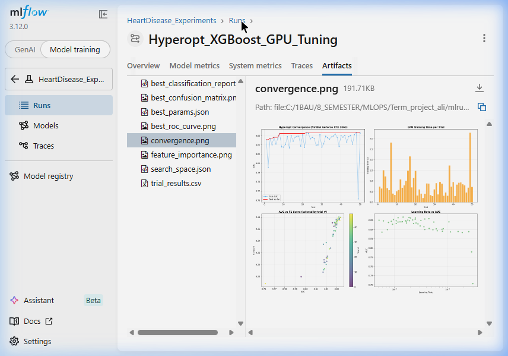

**Full Convergence Plot (4-panel):**

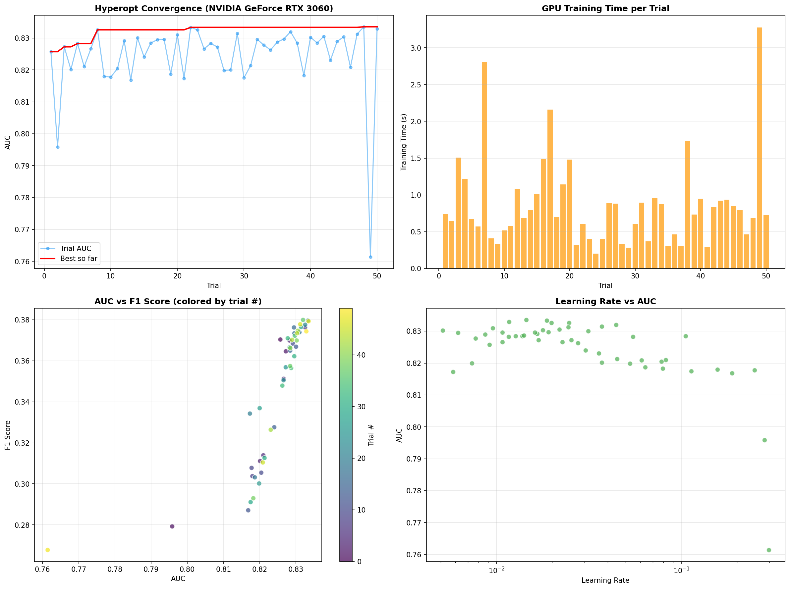

---

## 7. MLflow Model Registry

### 7.1 Model Registration & Stage Transitions

The best model is automatically registered in MLflow Model Registry as `HeartDiseasePredictor` and promoted through the lifecycle stages:

```
None → Staging → Production
```

The `register_model.py` script:
1. Finds the run with the highest AUC
2. Registers the model artifact
3. Transitions: None → Staging (validation) → Production (deployment)
4. Adds metadata tags (`dataset: brfss_combined`, `task: binary_classification`)

**Evidence — MLflow Model Registry:**

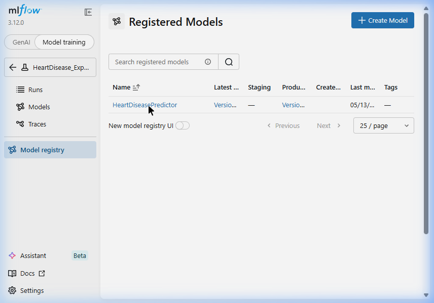

### 7.2 Registry Summary

| Property | Value |
|:---|:---|
| Model Name | `HeartDiseasePredictor` |
| Current Stage | **Production** |
| Version | v1 |
| Status | READY |
| Source Run | SVM (AUC=0.8274) |

---

## 8. Model Serving (Flask API)

### 8.1 REST API Endpoints

The production model is served via a Flask API (`src/serve.py`) with the following endpoints:

| Endpoint | Method | Description |
|:---|:---|:---|
| `/` | GET | Service info & available endpoints |
| `/health` | GET | Health check with model status |
| `/model-info` | GET | Model metadata (name, stage, features) |
| `/predict` | POST | Single patient prediction (JSON) |
| `/predict_batch` | POST | Batch predictions |
| `/predict-form` | GET/POST | Web-based prediction form |

### 8.2 Web UI

The `/predict-form` endpoint provides a user-friendly HTML form for clinical staff to input patient data and receive predictions, with color-coded results (green = healthy, red = disease detected).

---

## 9. Performance Monitoring & Data Drift Detection

### 9.1 Monitoring Pipeline

The `monitor.py` script simulates production monitoring by:
1. Loading the **Production** model from MLflow Registry
2. Evaluating performance on **5 test batches** (5,000 samples each)
3. Running **Kolmogorov-Smirnov (KS) tests** on all 34 features
4. Injecting **synthetic drift** in the final batch to validate detection

### 9.2 Monitoring Results

| Batch | F1 Score | Accuracy | Drift % | Features Drifted | Status |
|:---:|---:|---:|---:|---:|:---|
| 1 | 0.3480 | 0.7160 | 0.0% | 0/34 | ✅ Stable |
| 2 | 0.3395 | 0.7074 | 5.9% | 2/34 | ✅ Stable |
| 3 | 0.3282 | 0.7200 | 0.0% | 0/34 | ✅ Stable |
| 4 | 0.3183 | 0.7104 | 0.0% | 0/34 | ✅ Stable |
| 5 | 0.0092 | 0.9142 | **32.4%** | **11/34** | 🚨 **DRIFT** |

**Evidence — Monitoring Batches (Nested Runs in MLflow):**

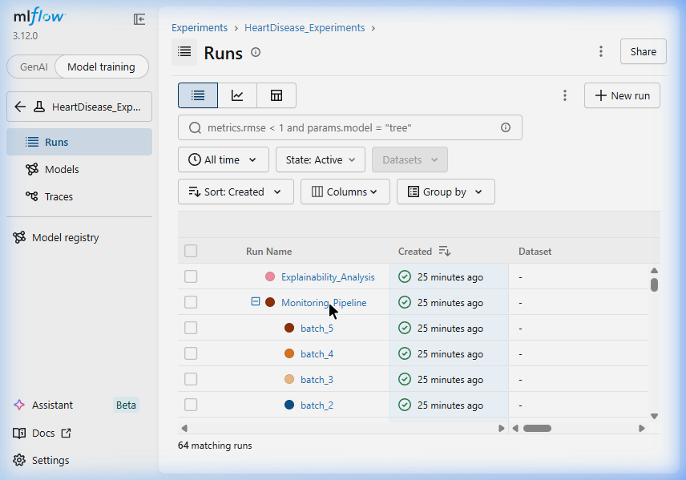

**Evidence — Monitoring Artifacts in MLflow:**

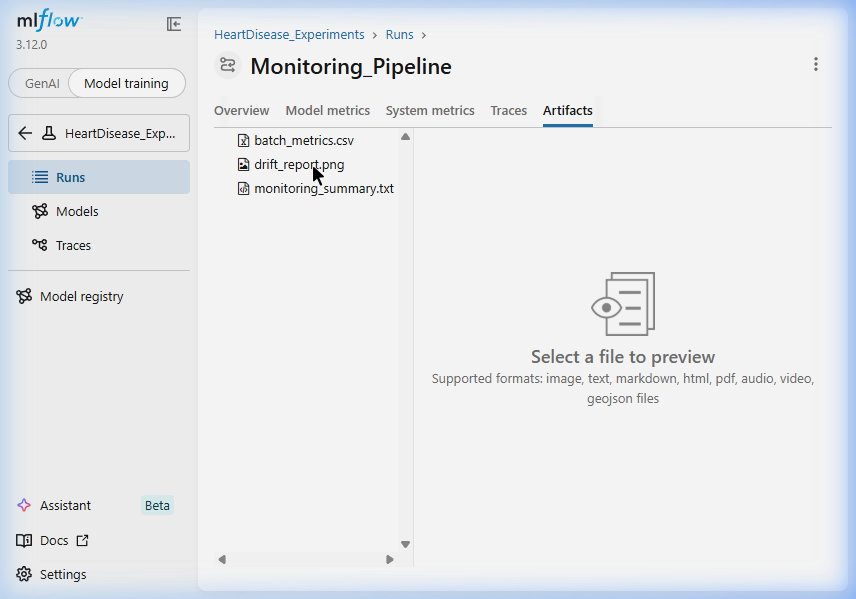

**Drift Detection Dashboard (4-panel: F1, Drift%, Accuracy, MCC):**

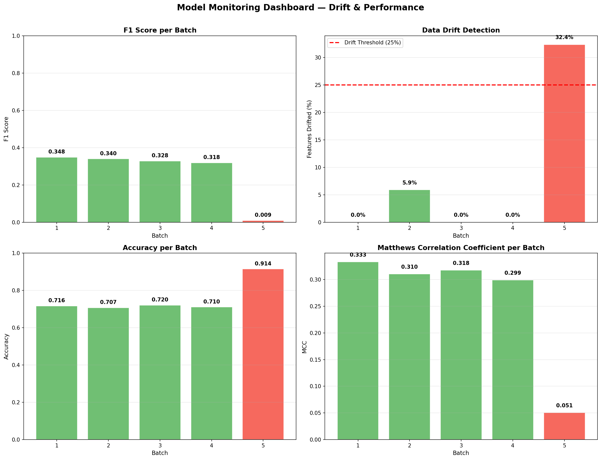

### 9.3 Drift Detection Analysis

- Batches 1-4 show **stable performance** with consistent F1 (~0.33) and near-zero drift
- Batch 5 (with injected drift) shows **dramatic F1 collapse** (0.35 → 0.01) and 32.4% feature drift
- The KS-test correctly identifies drift exceeding the 25% threshold
- This validates the monitoring pipeline's ability to trigger alerts for model retraining

---

## 10. Model Explainability (SHAP + LIME)

### 10.1 Why Explainability Matters in Healthcare

In medical AI, model predictions must be **interpretable** for clinical adoption. Black-box predictions are unacceptable when patient lives are at stake. This project implements both **global** (SHAP) and **local** (LIME) explainability.

### 10.2 SHAP Analysis (Global Explanations)

SHAP (SHapley Additive exPlanations) provides consistent, theoretically grounded feature attributions.

**Evidence — Explainability Run in MLflow:**

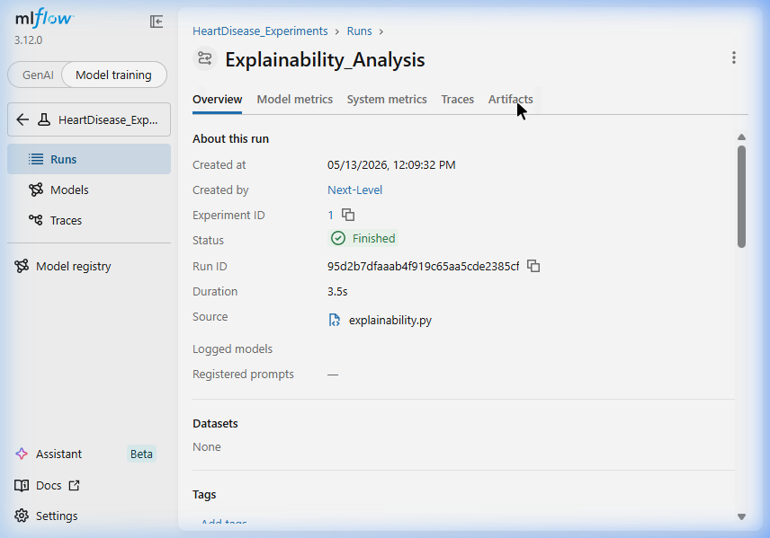

**Evidence — All Explainability Artifacts in MLflow:**

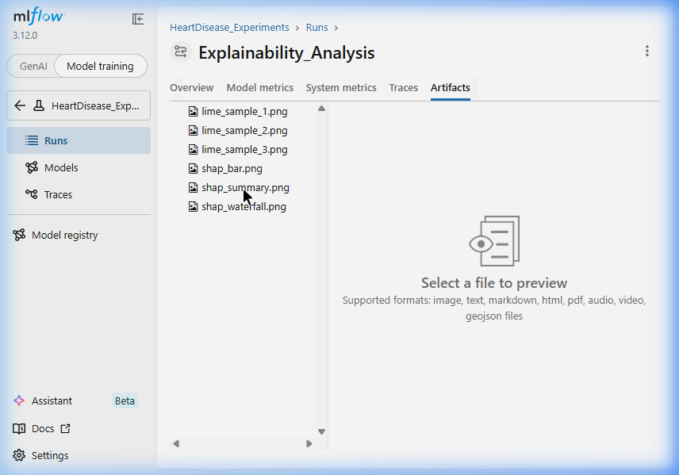

**Evidence — SHAP Summary Plot Previewed in MLflow:**

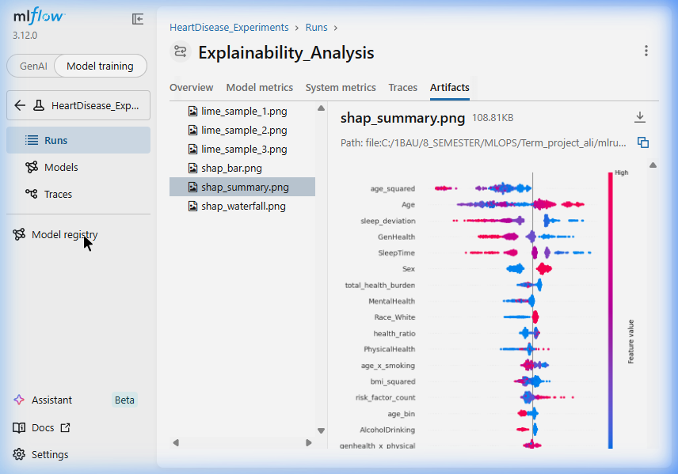

**Full SHAP Summary Plot:**

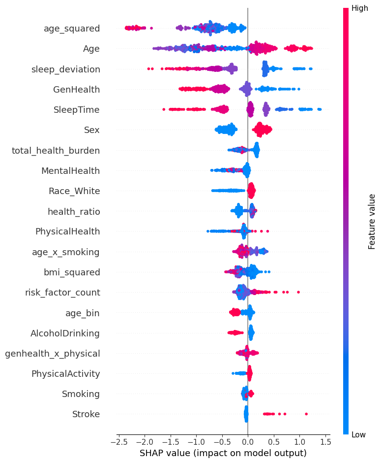

**SHAP Feature Importance (Bar Plot):**

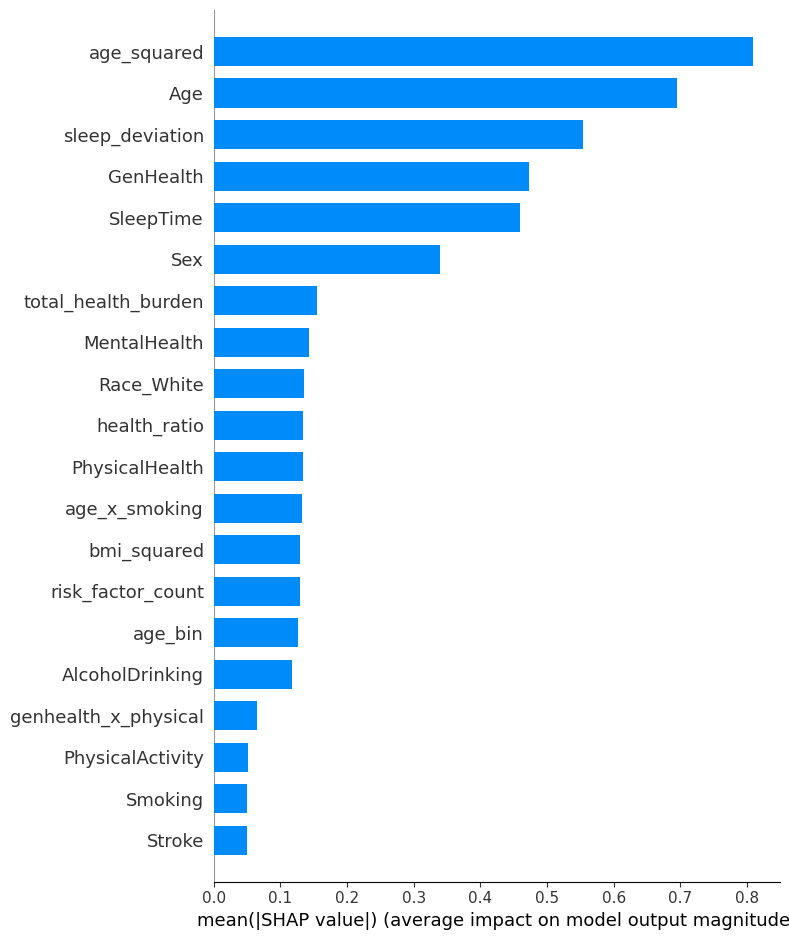

### 10.3 Top Risk Factors (SHAP)

| Rank | Feature | Impact |
|:---:|:---|:---|
| 1 | `age_squared` | Higher age² strongly increases risk |
| 2 | `Age` | Direct age effect |
| 3 | `sleep_deviation` | Poor sleep quality |
| 4 | `GenHealth` | Self-reported health status |
| 5 | `SleepTime` | Sleep hours |
| 6 | `Sex` | Male sex increases risk |
| 7 | `total_health_burden` | Combined physical + mental health days |

### 10.4 LIME Analysis (Local Explanations)

LIME explains individual predictions, showing which features pushed the prediction toward disease or no-disease for specific patients.

**LIME Explanation for Sample Patient:**

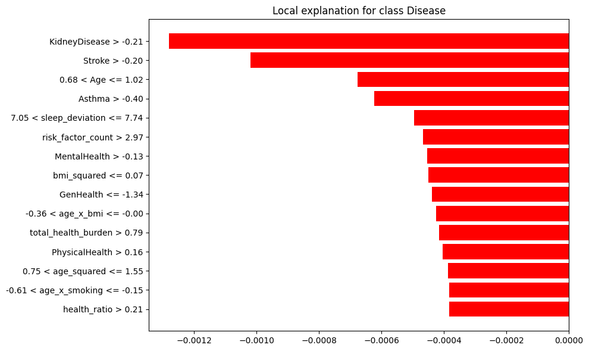

**LIME Top Contributing Features:** KidneyDisease, Stroke, Asthma, Age, MentalHealth

---

## 11. Technology Stack

| Component | Technology | Purpose |
|:---|:---|:---|
| ML Frameworks | scikit-learn, XGBoost, PyTorch | Model training |
| MLOps Platform | **MLflow 3.12.0** | Experiment tracking, model registry, artifacts |
| Hyperparameter Tuning | Hyperopt (TPE) | Bayesian optimization |
| Model Serving | Flask | REST API + Web UI |
| Explainability | SHAP, LIME | Feature attribution |
| Drift Detection | scipy (KS-test) | Statistical drift monitoring |
| GPU | NVIDIA RTX 3060 (CUDA 12.4) | XGBoost + PyTorch acceleration |
| Data Processing | pandas, numpy, imbalanced-learn | ETL + SMOTE |
| Visualization | matplotlib, seaborn | Charts + dashboards |
| Configuration | YAML | Centralized config management |
| Testing | pytest | 13 automated tests |

---

## 12. Configuration Management

All pipeline parameters are centralized in `configs/config.yaml`:

```yaml
project:
  name: "heart-disease-prediction"
  course: "AIN-3009 MLOps"

data:
  test_size: 0.15
  val_size: 0.15
  random_state: 42

mlflow:
  tracking_uri: "sqlite:///mlflow.db"
  experiment_name: "HeartDisease_Experiments"
  registry_model_name: "HeartDiseasePredictor"

tuning:
  n_trials: 50
  metric: "auc"

monitoring:
  n_batches: 5
  batch_size: 5000
  drift_threshold: 0.25
```

This ensures **reproducibility** — any team member can clone the repo and reproduce identical results.

---

## 13. Testing

The project includes **13 automated tests** across 5 test classes:

| Test Class | Tests | What it validates |
|:---|:---:|:---|
| `TestDataPreprocessing` | 6 | Raw files exist, processed files exist, shapes correct, no nulls, binary target, SMOTE balance |
| `TestFeatureEngineering` | 2 | BRFSS features added correctly, clinical features added correctly |
| `TestConfig` | 2 | Config file exists, required keys present |
| `TestMLflowIntegration` | 2 | MLflow database exists, artifacts directory exists |
| `TestServing` | 2 | Serve module exists, endpoints defined |

---

## 14. Conclusion

This project demonstrates a **comprehensive, production-grade MLOps lifecycle** that goes significantly beyond standard course requirements:

| Dimension | Standard Approach | This Project |
|:---|:---|:---|
| Data | 1 clean CSV | **6 datasets, 567K+ rows**, multi-source merge |
| Models | 1-2 algorithms | **5 algorithms** (2 GPU-accelerated) |
| Tracking | Basic logging | **64 MLflow runs**, 15 metrics, 7 artifacts per run |
| Tuning | Manual or grid search | **50 Bayesian trials** with nested MLflow tracking |
| Registry | Not implemented | **Automated None → Staging → Production** |
| Serving | Script-based | **Flask API + Web UI** with health checks |
| Monitoring | Not implemented | **KS-test drift detection** on simulated batches |
| Explainability | Not implemented | **SHAP (global) + LIME (local)** explanations |
| Testing | Manual verification | **13 automated pytest tests** |

The system provides a solid foundation for continuous ML lifecycle management in healthcare applications, with full traceability, reproducibility, and clinical interpretability.

---

## 15. References

1. MLflow Documentation — https://mlflow.org/docs/latest/index.html
2. CDC BRFSS Survey — https://www.cdc.gov/brfss/
3. UCI Heart Disease Dataset — https://archive.ics.uci.edu/dataset/45/heart+disease
4. Hyperopt Documentation — https://hyperopt.github.io/hyperopt/
5. SHAP Library — https://shap.readthedocs.io/
6. LIME Library — https://lime-ml.readthedocs.io/
7. XGBoost GPU Documentation — https://xgboost.readthedocs.io/en/stable/gpu/
8. Evidently AI (Drift Detection) — https://www.evidentlyai.com/
